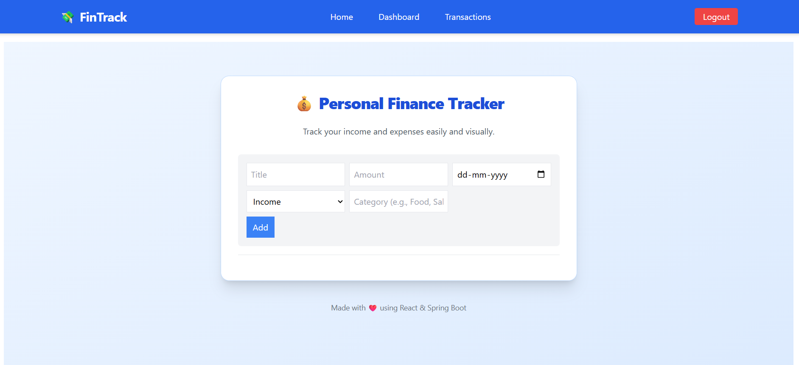

# Personal Finance Tracker

A full-stack personal finance tracking web app built with:

- React.js + Tailwind CSS (frontend)
- Spring Boot + PostgreSQL (backend)
- Recharts for data visualization
- JWT authentication
- Deployed on Vercel & Render

---

## Features

- Register/Login (JWT auth)
- Add income & expenses
- View transaction history
- Dashboard charts (bar, pie)
- Mobile responsive

---

## Live Demo

- **Frontend:** [https://personal-finance-client.vercel.app/](https://personal-finance-client.vercel.app/)
- **Backend API:** [https://personal-finance-server-z51x.onrender.com](https://personal-finance-server-z51x.onrender.com)

---

## Screenshots

### Login Page


### Dashboard Page


### Add Transaction Page


### Add home Page



---

## Technologies Used

- **Frontend:** React.js, Tailwind CSS, Recharts
- **Backend:** Java Spring Boot, PostgreSQL, JWT
- **Deployment:** Vercel (frontend), Render (backend)

---

## Setup Instructions (For Devs)

```bash
# Frontend
cd client
npm install
npm run dev
or npm start

# Backend
cd server
./mvnw spring-boot:run
```
